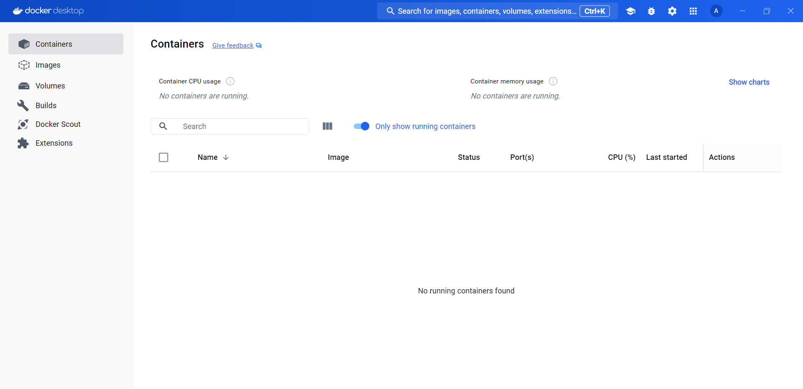
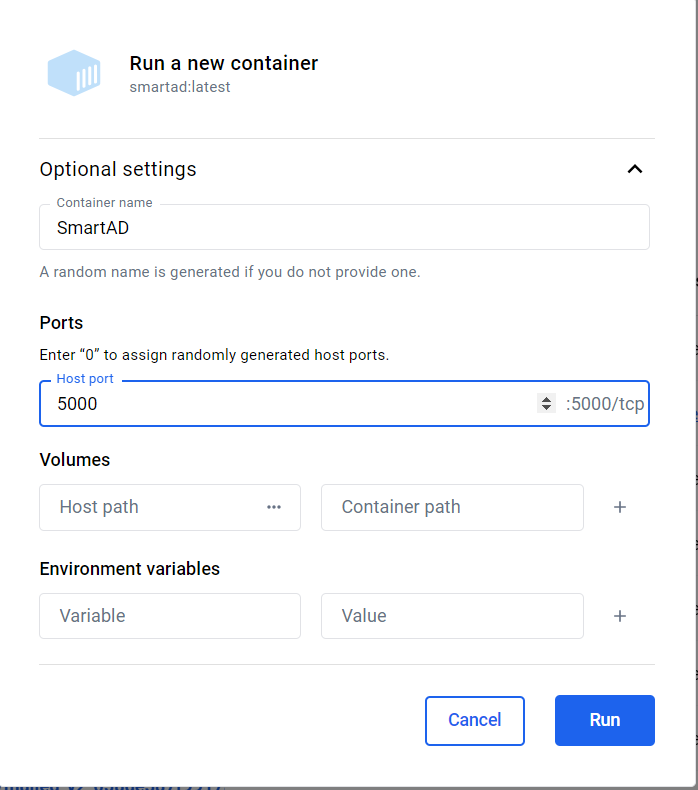
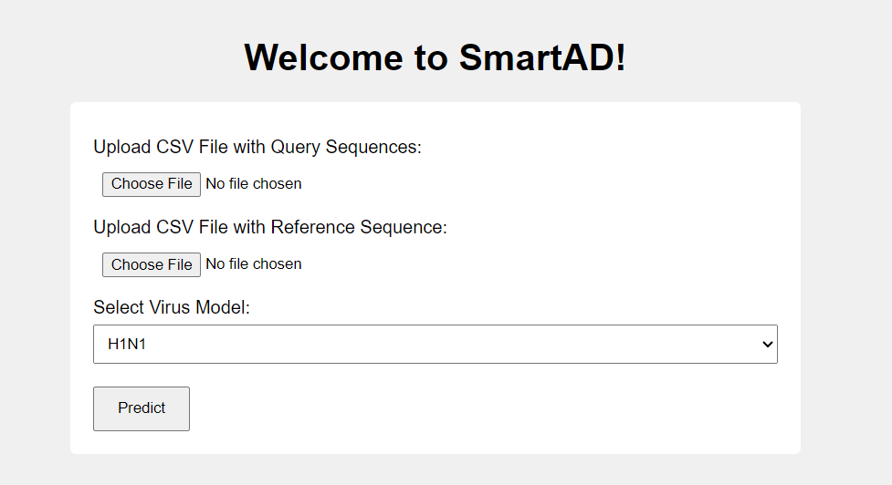

[](https://smartad-web.onrender.com)
[](https://hub.docker.com/r/ameknas/smartad)

# SmartAD: Predicting Antigenic Distances of Influenza Viruses

---

## Table of Contents
1. [Introduction](#introduction)
2. [Installation](#installation)
3. [Data Input Format](#data-input-format)
4. [Usage](#usage)
5. [Available Models](#available-models)
7. [Contributing](#contributing)
8. [License](#license)

---

## Introduction

Antigenic distances represent a quantitative measure of how much the immune system recognizes one viral strain as being distinct from another. For influenza viruses, understanding antigenic distances is crucial because it helps predict how well the immune system might respond to a new strain based on previous exposure or vaccination. Accurate antigenic distance predictions can inform vaccine strain selection and predict vaccine efficacy across different influenza seasons.

Influenza viruses, especially types A and B, undergo constant mutations in surface proteins like hemagglutinin (HA). These mutations can cause the virus to "drift" antigenically, meaning that immunity from prior infection or vaccination may be less effective against new strains. This drift is the main reason why the flu vaccine must be updated regularly. Therefore, predicting antigenic distances between viral strains is vital in the battle against influenza.

**SmartAD**, hosted as a web tool on **OnRender**, fits into this landscape by providing a streamlined interface for predicting antigenic distances between influenza strains. The predictions are powered by models trained on extensive datasets, building upon the existing methodology of a tool called **MetaFluAD**.

### MetaFluAD: The Basis of SmartAD

MetaFluAD, a cutting-edge tool developed by Qitao Jia, Yuanling Xia, Fanglin Dong, and Weihua Li, is a meta-learning framework designed to predict antigenic distances between influenza viruses. The method was originally published in a [paper](https://academic.oup.com/bib/article/25/5/bbae395/7731492) titled *MetaFluAD: Meta-learning for Predicting Antigenic Distances among Influenza Viruses*, and the source code is available on GitHub [here](https://github.com/kpollop/metafluad).

**SmartAD** builds upon this work by using an enhanced version of the MetaFluAD models. The difference lies in the training data: while the original MetaFluAD models were trained on publicly available datasets, the models powering SmartAD have been trained on a more extensive and proprietary dataset maintained by the **Influenza, Respiratory Viruses and Cornoaviruses (IRVC)** section at the **National Microbiology Laboratory (NML)**. This larger dataset provides a deeper and broader understanding of antigenic distances across a wider variety of influenza strains, leading to more accurate predictions.

In essence, SmartAD leverages the power of machine learning models to help researchers and public health officials understand how different influenza strains might interact with human immunity, guiding better vaccine formulation and public health strategies.

---

## Installation

### Docker Image

#### Command Line

To install and run **SmartAD** via Docker using the command line, follow these steps:

1. **Pull the Docker Image**
   ```bash
   docker pull ameknas/smartad:latest
   ```
   
2. **Run the Docker Container**
   ```bash
   docker run -p 5000:5000 ameknas/smartad:latest
   ```
   
3. **Access the Application**
   - Open your web browser and navigate to:
     ```
     http://localhost:5000
     ```
   - This will open the **SmartAD** web interface where you can begin using the application.

### Docker Desktop

For users with Docker Desktop, you can pull and run the **SmartAD** container directly from the Docker Desktop interface:

1. **Open Docker Desktop**
   
   

3. **Search for the SmartAD Image**
   - In the **Images** tab, locate the "Search for images on Docker Hub" field.
   - Type `ameknas/smartad` to find the SmartAD image.
     
   - 

4. **Pull the Image**
   - Select the **Pull** option to download the latest image to your Docker Desktop.
   - 

5. **Run the Container**
   - After the image has been pulled, locate it under the **Images** tab in Docker Desktop.
   - Click **Run** next to the image name.
   - Configure the **port mapping** to `5000:5000` so you can access the application on `localhost:5000`.
   - 

6. **Access the Application**
   - Open your web browser and navigate to:
     ```
     http://localhost:5000
     ```
   - This will take you to the **SmartAD** web interface, where you can begin using the application.



### Accessing the Deployed Web Application on OnRender

You can also access **SmartAD** through clicking the link to the web application deployed on [OnRender](https://smartad-web.onrender.com). Note the following when using the OnRender deployment:
   - It may take **2-3 minutes to load** the initial page.
   - Generating predictions may take an additional **2-3 minutes**.
   - The free-tier deployment has **limited memory capacity**, which may impact performance for larger jobs.

By following these steps, you can easily install and run **SmartAD** using Docker, either through the command line, Docker Desktop or OnRender, and access it directly from your browser.

---

## Data Input Format

For **SmartAD** to predict antigenic distances, it requires input data in the form of amino acid sequences for query and reference strains. Here’s the format required for each input file:

### Query Sequences

The query sequences file should contain multiple amino acid sequences with their corresponding strain IDs. The file format should be **CSV** and include two columns: `strain` and `sequence`. The `strain` column contains the unique identifier for each strain, and the `sequence` column contains the amino acid sequence. 

**Example Format:**

```csv
strain,sequence
StrainA,DTLCIGYHANNSTDTVDTVLEKNVTVTHSVNLLEDKHNGKLCKLRGVP
StrainB,DTLCIGYHANNSTDTVDTVLEKNVTVTHSVNLLEDKHNGKLCKLRGVAPLHL
StrainC,DTLCIGYHANNSTDTVDTVLEKNVTVTHSVNLLEDKHNGKLCKLRGVA
StrainD,DTLCIGYHANNSTDTVDTVLEKNVTVTHSVNLLEDKHNGKLCKLRGV
StrainE,DTLCIGYHANNSTDTVDTVLEKNVTVTHSVNLLEDKHNGKLCKLRGVAPLHLG
StrainF,DTLCIGYHANNSTDTVDTVLEKNVTVTHSVNLLEDKHNGKLCKLRGVPPLHLG
```

### Reference Sequence

The reference sequence file should include a single amino acid sequence with its corresponding strain ID. This file should also be in **CSV** format with two columns: `strain` and `sequence`. 

**Example Format:**

```csv
strain,sequence
Reference,DTLCIGYHANNSTDTVDTVLEKNVTVTHSVNLLEDKHNGKLCKLRGVP
```

### Notes:
- Both files should be saved with a `.csv` extension.
- Each sequence should be composed of valid amino acid letters without any special characters.
- Ensure that your reference sequence file only contains one row.

Using this format will allow **SmartAD** to process the data effectively for antigenic distance predictions.

---

## Usage

Using **SmartAD** is straightforward. Follow the steps below to predict antigenic distances between influenza strains:

1. **Upload Query Sequences**  
   - Click **Choose File** next to "Upload CSV File with Query Sequences."
   - Select your query sequences CSV file, which contains multiple strain IDs and their amino acid sequences.

2. **Upload Reference Sequence**  
   - Click **Choose File** next to "Upload CSV File with Reference Sequence."
   - Select your reference sequence CSV file, which should contain a single strain ID and its amino acid sequence.

3. **Select Virus Model**  
   - From the dropdown menu labeled "Select Virus Model," choose the appropriate model for your analysis (e.g., H1N1, H3N2, etc.).

4. **Run Prediction**  
   - Click the **Predict** button to start the analysis. 

5. **View Results**  
   - After processing, you’ll be redirected to a results page displaying the predicted antigenic distances. Here, you can review and interpret the outcomes.

By following these steps, you can use **SmartAD** to analyze antigenic distances between different influenza strains with ease.

---

## Available Models

**SmartAD** provides several pre-trained models specifically tailored for different influenza strains. These models allow for accurate antigenic distance predictions based on the selected strain type. Below are the currently available models:

- **H1N1**: Uses the `model_H1N1.pth` file, designed for the H1N1 strain of Influenza A.
- **H3N2**: Uses the `model_H3N2.pth` file, tailored for the H3N2 strain of Influenza A.
- **H5N1**: Uses the `model_H5N1.pth` file, optimized for the H5N1 strain of Influenza A.
- **Influenza B**: Uses the `model_B-vic.pth` file, specifically developed for Influenza B (Victoria lineage).

Each model has been trained to predict antigenic distances with high accuracy based on comprehensive datasets. Select the appropriate model from the dropdown menu to match the strain type of your input sequences.

---

## Contributing

This project is produced by **IRVC (Influenza, Respiratory Viruses and Cornoaviruses)** personnel at **PHAC (Public Health Agency of Canada)**

---

## License

This project is licensed under the **Apache License 2.0**. You are free to use, modify, and distribute this software in compliance with the license.

For more details, refer to the full text of the [Apache License 2.0](https://www.apache.org/licenses/LICENSE-2.0).
